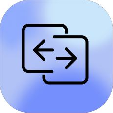

<div>
  
  <a href="https://www.buymeacoffee.com/clipsync" align="right">
    
  </a>
  <br clear="both"/>
</div>

# ClipSync: Seamless Universal Clipboard

**ClipSync** is the ultimate tool to synchronize your clipboard across Android and Mac—**instantly** and **securely**. Copy on your Mac, paste on your Android. It's that simple.

> **Open Source, Secure, and Blazing Fast.**

---

## 🚀 Features

- **Instant Sync**: Copy text on one device and it’s immediately available on the other. No extra buttons or annoying persistent notifications to click on Android to send the clipboard—just copy anything normally and paste it directly on the Mac OR the other way around.
- **End-to-End Encryption**: Your data is encrypted with AES-256 (GCM) locally before it leaves your device and decrypted locally on each device before getting copied to the clipboard.
- **Cross-Platform**: Seamlessly works between **macOS** and **Android**.
- **Efficient**: Optimized for minimal battery drain and background usage.
- **Stunning UI**: Beautiful, native designs for both platforms.

---

## 🛠 Tech Stack

### macOS App
* **Language**: Swift 5.9
* **Framework**: SwiftUI & AppKit
* **Architecture**: MVVM
* **Dependencies**: Firebase, Lottie

### Android App
* **Language**: Kotlin
* **Framework**: Jetpack Compose, Material 3
* **Architecture**: MVVM / Clean Architecture
* **Dependencies**: Firebase, Coroutines, Hilt

---

## 📦 Getting Started

To keep things organized, this repository contains both client applications.

###   Installation for macOS

Since this app is not signed with a developer ID, follow these steps to install it:

1. Download the ZIP file from the repository.
2. Extract the ZIP file to a location of your choice.
3. Double-click the `.command` file included in the extracted folder to start the installation process.
4. Follow the on-screen instructions to complete the installation.

###   Installation for Android

Since this app is distributed via APK (Sideloading), you need to follow these steps to install and enable the necessary permissions, specifically for Android 13 and newer.

##### 1. Prepare for Installation
**Disable Play Protect**
Google Play Protect may block the installation since the app isn't from the Play Store.
1. Open the **Play Store**.
2. Tap your **Profile Icon** (top right) → **Play Protect**.
3. Tap **Settings (⚙️)** (top right).
4. Turn **OFF** "Scan apps with Play Protect".

##### 2. Enable Accessibility Permission (Critical Step)
ClipSync uses an Accessibility Service to detect copy events. On **Android 13+**, this setting is "Restricted" for sideloaded apps by default. Here is how to unlock it:

1. Open **ClipSync** and tap the **Accessibility** toggle.
2. If it is grayed out or shows a "Restricted Setting" popup, click **OK**.
3. Go to your phone's **Settings** → **Apps** → **ClipSync**.
4. Tap the **Three Dots (⋮)** in the top-right corner.
5. Select **Allow restricted settings**. (You may need to verify your fingerprint/PIN).
6. **Go Back** to the ClipSync app and tap the toggle again.
7. Find **ClipSync** under "Downloaded Apps" and turn it **ON**.

---

## 🔧 Self-Hosting (Bring Your Own Firebase)

ClipSync has no custom server — both apps relay through **Firebase Firestore**. You can point the apps at **your own Firebase project** for full control over your backend, access rules, and data residency. This is also required to build the apps from source.

#### 1. Create a Firebase project
In the [Firebase Console](https://console.firebase.google.com/), create a project and enable:
- **Cloud Firestore**
- **Authentication** → **Anonymous** sign-in provider
- **Cloud Messaging** (for OTP/notification relay)

#### 2. Add your Firebase config files
These files are git-ignored, so each contributor supplies their own:
- **Android:** download `google-services.json` → place in `android/app/`
- **macOS:** download `GoogleService-Info.plist` → add to the `mac/ClipSync/` target

#### 3. Fill in the config templates
The repo ships `.example` templates. Copy each one (dropping the `.example` suffix) and fill in your values:

```bash
# Android
cp android/app/src/main/java/com/bunty/clipsync/RegionConfig.kt.example \
   android/app/src/main/java/com/bunty/clipsync/RegionConfig.kt
cp android/app/src/main/java/com/bunty/clipsync/Secrets.kt.example \
   android/app/src/main/java/com/bunty/clipsync/Secrets.kt

# macOS
cp mac/ClipSync/RegionConfig.swift.example mac/ClipSync/RegionConfig.swift
```

#### 4. Deploy the Firestore security rules
A reference copy of the rules lives at [`firestore.rules.example`](firestore.rules.example). Copy and deploy it:

```bash
cp firestore.rules.example firestore.rules
firebase deploy --only firestore:rules
```

### 🔒 Security note

The Firestore rules are now **published and auditable** in [`firestore.rules.example`](firestore.rules.example). They require every request to carry a valid Firebase Auth token (anonymous auth is enough) and deny everything by default.

> **Heads up:** the reference rules require authentication. The Android client already signs in anonymously on launch, but the macOS client does not yet authenticate. Deploy the auth-required rules only after the Mac client has been updated to sign in anonymously, otherwise the Mac app will lose Firestore access. See the comments in `firestore.rules.example` for details and planned per-pairing hardening.

---

## 🤝 Contributing

We love contributions!
1. **Fork** the project.
2. Create your **Feature Branch**.
3. **Commit** your changes.
4. **Push** to the branch.
5. Open a **Pull Request**.

### Support the Project

If you find ClipSync useful and want to support its development, consider buying me a coffee!

<a href="https://buymeacoffee.com/clipsync"></a>

---

## 📜 License

Distributed under the **MIT License**. See `LICENSE` for more information.
