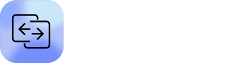
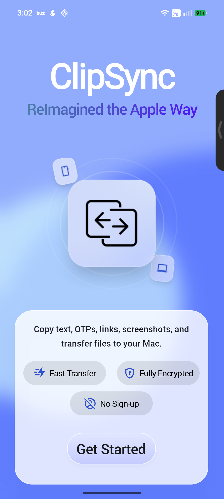
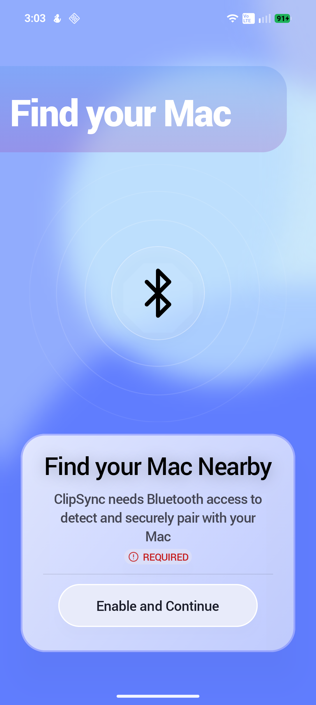
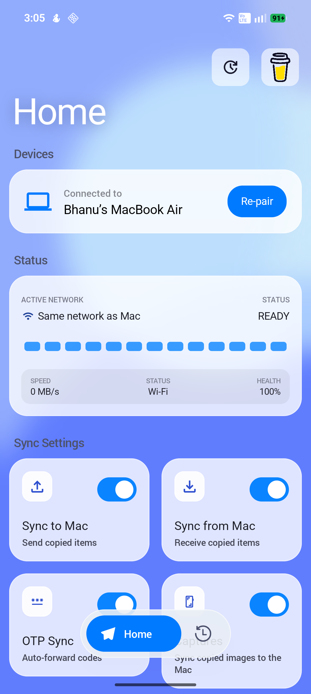
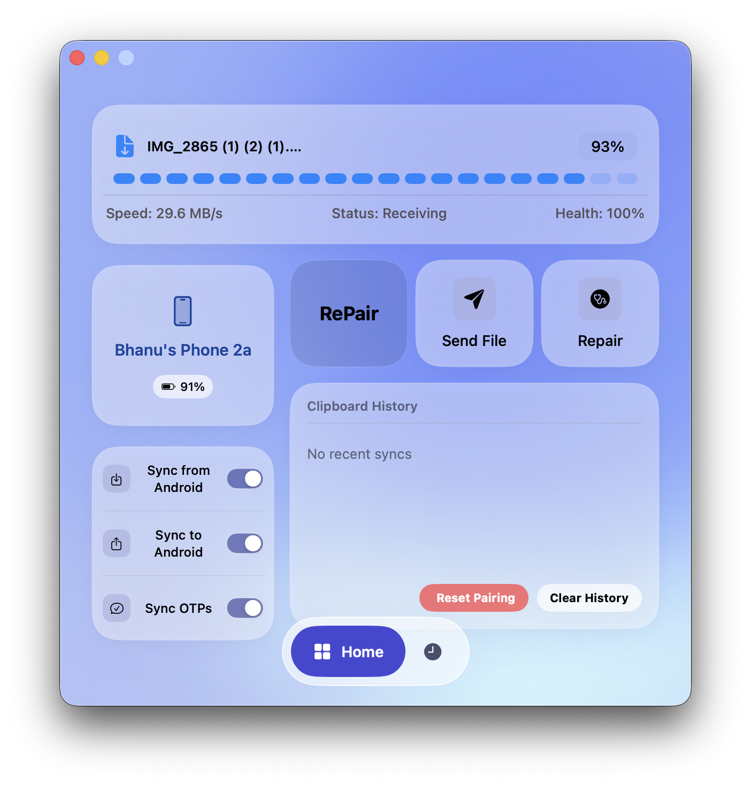
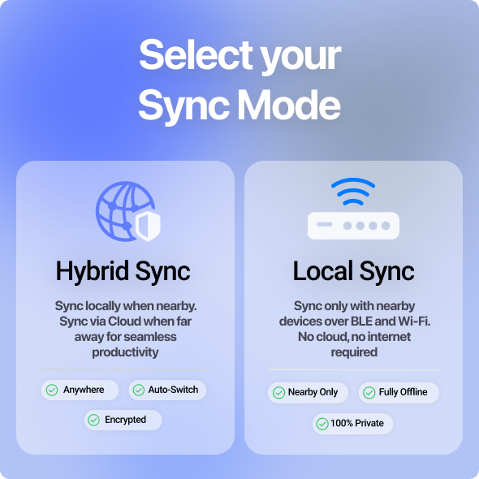
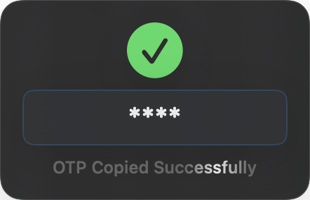

<p align="center">
  <picture>
    <source media="(prefers-color-scheme: dark)" srcset="assets/banner-dark.svg">
    <source media="(prefers-color-scheme: light)" srcset="assets/title-light.svg">
    
  </picture>
</p>

<br/>

<h3 align="center">
  ClipSync is the ultimate way to sync your clipboard and transfer files between Android and Mac—instantly and securely. Copy on your Mac, paste on your Android, and transfer full files at blazing-fast speeds. Simple, seamless, and effortless.
</h3>

<br/>

<p align="center">
  <a href="https://github.com/WinShell-Bhanu/Clipsync/releases/latest/download/Clipsync.Release.zip"></a>
  &nbsp;&nbsp;
  <a href="https://github.com/WinShell-Bhanu/Clipsync/releases/latest/download/app-release.apk"></a>
</p>

<p align="center">
  <a href="https://github.com/WinShell-Bhanu/CLipSync/releases/latest"></a>
  &nbsp;
  <a href="https://github.com/WinShell-Bhanu/ClipSync/releases"></a>
  &nbsp;
  <a href="LICENSE"></a>
  &nbsp;
  <a href="https://www.buymeacoffee.com/clipsync"></a>
  &nbsp;
  <a href="https://github.com/WinShell-Bhanu/Clipsync/stargazers"></a>
</p>

<br/><br/><br/>

<h1 align="center">Screenshots</h1>

<p align="center">
  
  &nbsp;&nbsp;&nbsp;
  
  &nbsp;&nbsp;&nbsp;
  
  &nbsp;&nbsp;&nbsp;
  
</p>


## Features

-  **Instant Sync** — Your clipboard is synchronized across Android and Mac the moment you hit copy. No matter if it's text, links, or images, it's instantly available on your other device without any manual intervention.
  ```bash
   Tap Copy on Android -----> Just press Cmd+V on Mac
   ```

-  **Fast File Transfer** — Send files of any size quickly and securely between your devices. Whether it's a quick document or gigabytes of media, ClipSync handles it with unmatched reliability.
  
  <p align="center">
  
</p>

-  **Ultra-Fast Transfer Mode** — Experience blazing-fast transfer speeds that match or even beat AirDrop. We utilize optimized network protocols to ensure you never have to wait for large file transfers again.The only downside is that , its works by removing the encryption of the transfer so its highly recommended to use on Private or Home Networks.
  <p align="center">
  
</p>

-  **Cloud & Local Modes** — Choose between cloud sync for anywhere access or local network mode for maximum speed. Local mode ensures your data never leaves your home network, giving you absolute privacy and peace of mind.
    <p align="center">
    
</p>

-  **OTP Syncs** — Securely and instantly sync One-Time Passwords (OTPs) directly between your devices. You'll never have to manually retype a verification code from your phone to your Mac again.
   <p align="center">
   
</p>

-  **Frictionless** — Designed to be completely seamless and stay out of your way. Just copy on one device and paste on the other, just like it's the exact same machine.

## Installation

### macOS
Head to the [Releases tab](https://github.com/WinShell-Bhanu/Clipsync/releases/latest) or click the "Download for macOS" button to grab the `Clipsync.Release.pkg`.

**Note:** When opening the `.pkg` for the first time, macOS may block the app with an "unidentified developer" warning—this is completely normal. Just click **'Done'**. Then:
1. Open **System Settings** ➔ **Privacy and Security**.
2. Scroll down and click **"Open anyway"**.
3. Proceed with the installation as usual.

To enable the ClipSync share extension ➔ Open **System Settings** ➔ **Privacy & Security** ➔ **Extensions** ➔ **Sharing**, and check the box for ClipSync.

### Android
Head to the [Releases tab](https://github.com/WinShell-Bhanu/Clipsync/releases/latest) or click the "Download for Android" button to grab the `app-release.apk` and install it.

> [!WARNING]
> **Accessibility Permission Blocked?**
> Android may block the accessibility permission required by the app. If you try to grant the permission and it's blocked, follow these steps:
> 1. Close the app (but don't swipe it away from memory).
> 2. Long-press the ClipSync app icon and tap **App Info**.
> 3. Tap the **3 dots** in the top right corner and select **"Allow restricted settings"**.
> 4. Enter your PIN or use your fingerprint to authenticate.
> 5. Go back to the ClipSync app, and you will now be able to grant the accessibility permission.

---

## Local Build

If you prefer to compile ClipSync from source yourself, follow the instructions below.

### macOS Build
1. Clone the repository and navigate to the mac folder:
   ```bash
   git clone https://github.com/WinShell-Bhanu/Clipsync
   cd Clipsync/mac
   ```
2. Open `Clipsync.xcodeproj` in Xcode.
3. In the menu bar, go to **Product ➔ Archive** and wait for it to finish compiling.
4. After a successful build, go to **Window ➔ Organizer**.
5. Select the archive, click **Distribute App**, select **Custom**, choose **Copy App**, and save it to a local folder.
6. Drag the newly built `ClipSync` app into your **Applications** folder.

> [!NOTE]
> Cloud sync will not work out-of-the-box on local builds as it relies on Firebase servers. To get cloud sync working, you must provide your own `google-services.json` / `GoogleService-Info.plist` from Firebase. **Local sync mode will work normally.**

### Android Build
1. Open the `android` folder from the cloned repository in Android Studio.
2. In the menu bar, go to **Build ➔ Build Bundle(s) / APK(s) ➔ Build APK(s)** to generate the compiled APK.
3. Once generated, locate the APK and install it on your device.

---

## Contributing

As this project is fully free and the server costs are handled personally, any contributions—whether it's code, bug reports, or simply spreading the word—are massively appreciated! It would be awesome if you could help this repo grow by contributing.

<a href="https://github.com/WinShell-Bhanu/ClipSync/graphs/contributors">
  
</a>

<p align="center">
  <a href="https://www.buymeacoffee.com/clipsync"></a>
</p>

## License

[MIT](LICENSE)
